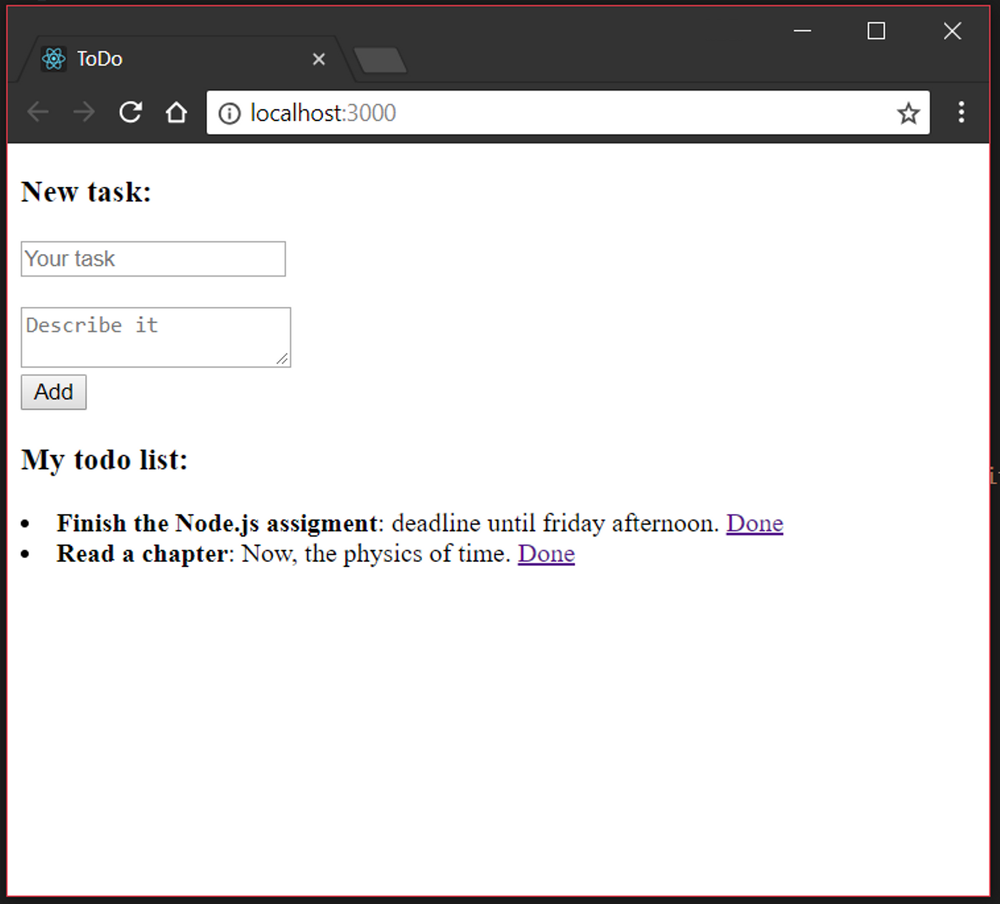
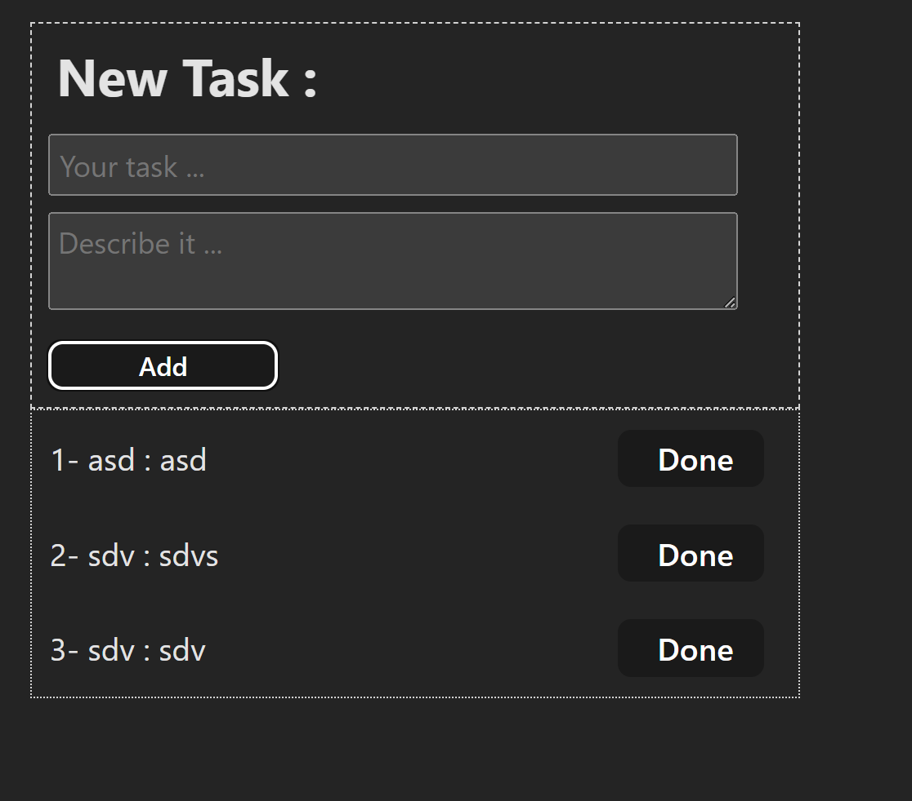

# React + ToDo
| Assignment                          | Project                        |
|----------------------------------|----------------------------------|
|    |    |

### The app content: 
- Two inputs: Task input and Description input.
- Add button.
- A-List of ToDos. 
- Done button after each task. 

### How do I install the project? 
- git clone [repository-url] or downlod the project files
- cd path/to/your/project
- npm install
- npm run dev
-  http://localhost:5173/