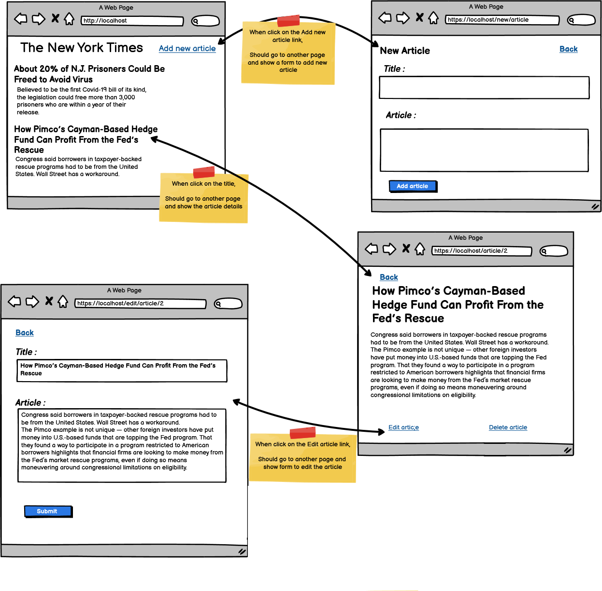

# **Node.js Message Post Management Application**

## **Overview**
This project is part of a Node.js bootcamp challenge. It demonstrates the use of **Node.js**, **Express.js**, and **EJS (Embedded JavaScript)** to build a simple **Post Message Application**. The application allows users to:
- View a list of posts.
- Add new posts.
- Edit existing posts.
- Delete post.
- View post details.

---

<p align="center">
   
</p>

---

### **Key Files**
- **`app.js`**: Entry point of the application. Configures middleware, routes, and starts the server.
- **`configs/mongoose.js`**: Handles MongoDB connection using Mongoose.
- **`models/feed.js`**: Defines the schema and model for posts.
- **`controllers/controller.js`**: Contains the logic for handling routes and CRUD operations.
- **`routes/router.js`**: Defines the application's routes.
- **`views/`**: Contains EJS templates for rendering the UI.
- **`public/css/style.css`**: Stylesheet for the application.

---

## **Installation and Setup**
1. Clone the repository:
   ```bash
   git clone <repository-url>
   cd ChallengeFacebook
   ```
2. Install dependencies:
   ```bash
   npm install
   ```
3. Create a `.env` file in the root directory and add the following:
   ```
   PORT=3000
   MONGO_URI=<your-mongodb-uri>
   ```
4. Start the application:
   - For production:
     ```bash
     npm start
     ```
   - For development with live reload:
     ```bash
     npm run dev
     ```

---

## **Endpoints**
### **GET Requests**
- `/`: Redirects to `/feed`.
- `/feed`: Displays the list of all posts.
- `/feed/:index`: Displays the details of a specific post.
- `/feed/edit/:index`: Displays the edit page for a specific post.
- `/feed/delete/:index`: Deletes a specific post.

### **POST Requests**
- `/new-message`: Adds a new post.
- `/feed/edit/:index`: Updates an existing post.

---

## **Project Routines**
### **Database Connection**
The MongoDB connection is handled in [`configs/mongoose.js`](configs/mongoose.js). It uses the `MONGO_URI` from the `.env` file to establish a connection.

### **CRUD Operations**
- **Create**: Posts are created using the `addMessage` function in [`controllers/controller.js`](controllers/controller.js).
- **Read**: Posts are fetched using the `getAlldata` function in [`controllers/utils.js`](controllers/utils.js).
- **Update**: Posts are updated using the `updateMessage` function in [`controllers/controller.js`](controllers/controller.js).
- **Delete**: Posts are deleted using the `deleteMessage` function in [`controllers/controller.js`](controllers/controller.js).

### **Error Handling**
Errors during database operations are handled using the `handleErrors` function in [`controllers/utils.js`](controllers/utils.js).

---

## **Technologies Used**
- **Node.js**: Backend runtime environment.
- **Express.js**: Web framework for Node.js.
- **EJS**: Templating engine for rendering dynamic HTML.
- **Mongoose**: MongoDB object modeling tool.
- **Nodemon**: Development tool for live-reloading the server.

---

## **Folder Structure**
```
.env
.gitignore
app.js
package.json
README.md
configs/
    mongoose.js
controllers/
    controller.js
    utils.js
models/
    feed.js
public/
    demo.png
    css/
        style.css
routes/
    router.js
views/
    details.ejs
    edit-page.ejs
    index.ejs
    partials/
        head.ejs
```

---
