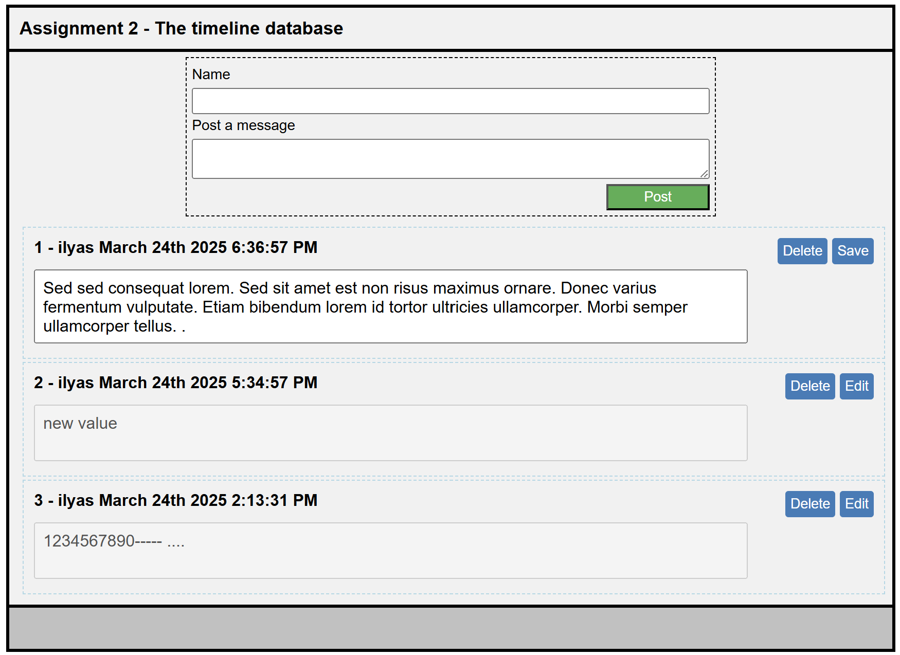

<h1 align="center">Assignment 1 - The timeline</h1>
<p  align="center">

</p>

## Backend with NodeJs.
## Frontend with Vanilla JS.
## MongoDB and Mongoose ORM.
## Full CRUD operations.

```bash
- npm i
- npm run dev
- Go to http://localhost:3000
```

