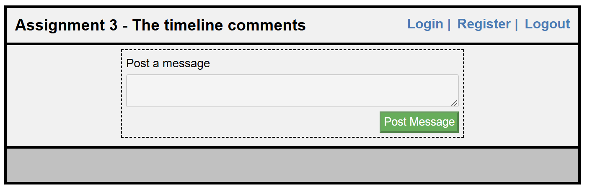

# Assignment 3 - The Timeline Comments

## Screenshots

### Frontend Screenshots

| Front Page | Login Page |
|------------|------------|
|  |  |

| After Login | Register Page |
|-------------|---------------|
|  |  |

---

## Features

- Backend with Node.js.
- Frontend with Vanilla JS (No EJS).
- MongoDB and Mongoose ORM.
- Full CRUD operations.

---

## How to Run the Project

```bash
# Clone or download the project
git clone <full-repository-url>

# Navigate to the project directory with 'cd' command or file explorer.
 Assignment3-TheTimelineComments

# Install dependencies
npm install

# Create .env file in the project main directory and assign  your values  to the variables.
PORT=...   
MONGO_URI=...

# Start the development server
npm run dev

# Open your browser and go to
http://localhost:3000
```

## How do you use project?
- Register yourself via Register Form.
- Login the project via Login Form.
- Post your first message.
- Add Comment on the messages.
- Make CRUD operations with related butons.

## ERD (entity-relationship diagram)


## Relationships:

### Users <--> Messages:
One user can create many messages (1:N relationship).
Each message belongs to one user.

### Messages <-->Comments:
One message can have many comments (1:N relationship).
Each comment belongs to one message.

### Users <-->Comments:
One user can create many comments (1:N relationship).
Each comment belongs to one user.

## Explanation of Relationships:

1. One-to-One (1:1) Relationship:
- Definition: Each entity in one collection is associated with exactly one entity in another collection.
- Example: A User has one Profile, and each Profile belongs to one User.
2. One-to-Many (1:N) Relationship:
- Definition: One entity in a collection is associated with multiple entities in another collection.
- Example: A User can create many Messages, but each Message belongs to only one User.
3. Many-to-Many (M:N) Relationship:
- Definition: Many entities in one collection are associated with many entities in another collection.
- Example: A User can belong to many Groups, and each Group can have many Users.