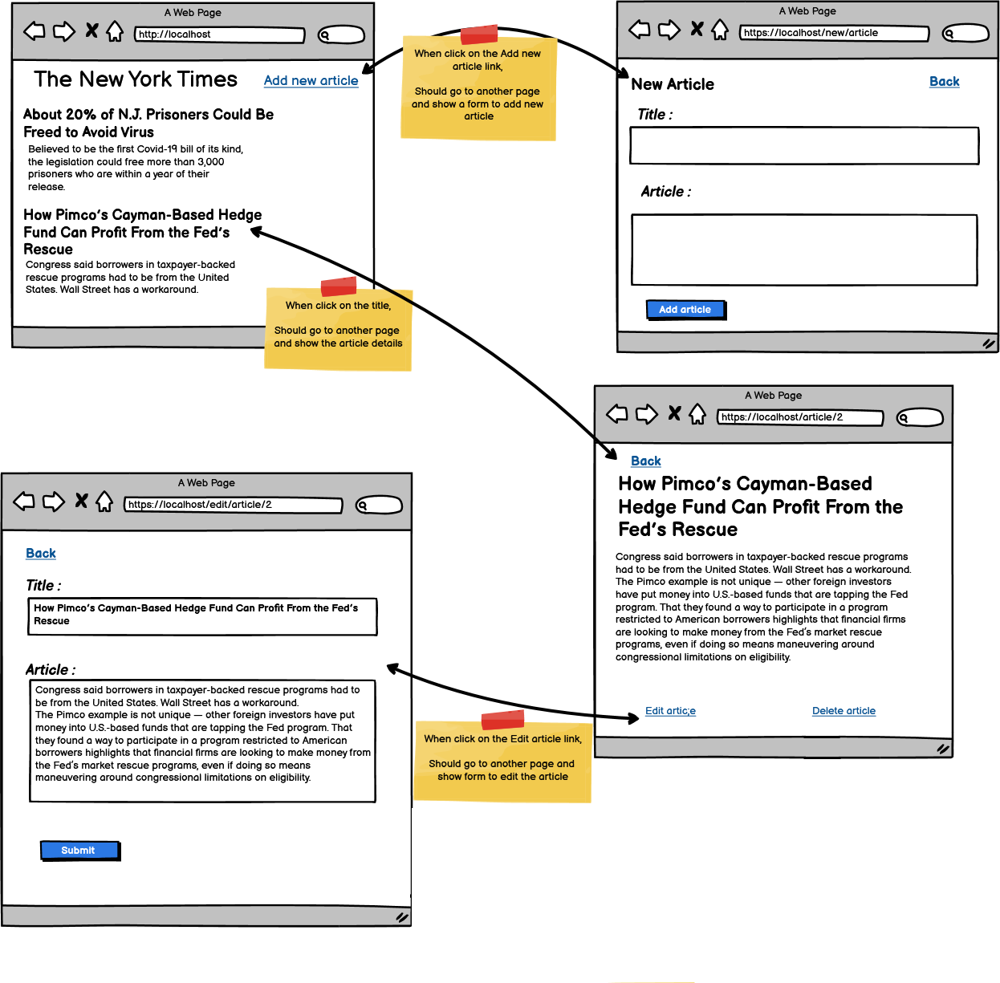

# **Node.js Article Management App**

## **Overview**
This project is part of a Node.js bootcamp challenge. It demonstrates the use of **Node.js**, **Express.js**, and **EJS (Embedded JavaScript)** to build a simple **Article Management Application**. The application allows users to:
- View a list of articles.
- Add new articles.
- Edit existing articles.
- Delete articles.
- View article details.

---
<p align="center" >
   
</p>

---

## **Features**
1. **Home Page:**
   - Displays a list of all articles stored in the database.
   - Each article includes a title and a link to view its details.

2. **Add New Article:**
   - A form to create a new article with a title and content.
   - Submitting the form saves the article to the database.

3. **Edit Article:**
   - Allows users to update an existing article.
   - Pre-fills the form with the current article data.

4. **Delete Article:**
   - Removes an article from the database.

5. **View Article Details:**
   - Displays the full content of a selected article.

6. **Unified Add/Edit Functionality:**
   - The same form is used for both adding and editing articles, determined by the presence of an article ID.

---

## **Project Structure**
The project is organized into the following directories and files:

```
project/
├── public/                     # Static files (CSS, images, etc.)
│   ├── css/
│   │   └── style.css           # Styles for the application
├── views/                      # EJS templates for rendering pages
│   ├── index.ejs               # Home page
│   ├── new-article-page.ejs    # Add/Edit article page
│   ├── details.ejs             # Article details page
│   ├── partials/               # Shared partial templates
│   │   └── head.ejs            # Shared <head> section
├── routes/                     # Route definitions
│   ├── main-routes.js          # Main router file (merges page and controller routes)
├── controllers/                # Controller logic for handling requests
│   └── article-controller.js   # Handles article-related logic
├── models/                     # Database models
│   └── articles.js             # Mongoose schema for articles
├── app.js                      # Main application entry point
├── package.json                # Project dependencies and scripts
└── README.md                   # Project documentation
```

---

## **Key Approaches**
### **1. Unified Add/Edit Functionality**
- The `addArticle` function handles both adding new articles and updating existing ones.
- The form dynamically includes an article ID (`_id`) when editing, allowing the server to determine whether to update or create a new article.

### **2. MVC Architecture**
The project follows the **Model-View-Controller (MVC)** pattern:
- **Model:** Defines the schema for articles using Mongoose.
- **View:** Uses EJS templates to render dynamic HTML pages.
- **Controller:** Handles the business logic for fetching, updating, and deleting articles.

### **3. Modular Route Management**
- A single `main-routes.js` file is used to merge both **page routes** (for navigation) and **controller routes** (for business logic).
- This approach keeps the app.js file clean and focused on middleware and server configuration.

### **4. Dynamic EJS Templates**
- EJS templates are used to render pages dynamically based on the data passed from the server.
- Conditional rendering is used to differentiate between "Add Article" and "Edit Article" forms.

### **5. Error Handling**
- Proper error handling is implemented to ensure the application gracefully handles issues like missing articles or database errors.

---

## **How to Run the Project**
### **Prerequisites**
- Node.js installed on your machine.
- MongoDB installed and running locally or a connection string to a MongoDB Atlas cluster.

### **Steps to Run**
1. Clone the repository:
   ```bash
   git clone <repository-url>
   cd <repository-folder>
   ```

2. Install dependencies:
   ```bash
   npm install
   ```

3. Set up the database:
   - Create a .env file in the root directory and add your MongoDB connection string:
     ```
     MONGO_URI=...
     ```

4. Start the server:
   ```bash
   npm start
   ```

5. Open your browser and navigate to:
   ```
   http://localhost:3000
   ```

---

## **Endpoints**
### **Page Routes**
| Method | Endpoint          | Description                  |
|--------|-------------------|------------------------------|
| GET    | `/`               | Displays the home page.      |
| GET    | `/new-article`    | Displays the add article form. |
| GET    | `/edit-article/:id` | Displays the edit article form. |
| GET    | `/details/:id`    | Displays the article details. |

### **Controller Routes**
| Method | Endpoint          | Description                  |
|--------|-------------------|------------------------------|
| POST   | `/new/article`    | Adds or updates an article.  |
| POST   | `/delete/:id`     | Deletes an article.          |

---

## **Technologies Used**
- **Node.js:** Backend runtime environment.
- **Express.js:** Web framework for routing and middleware.
- **EJS:** Templating engine for rendering dynamic HTML.
- **MongoDB & Mongoose:** Database and ORM for managing articles.
- **CSS:** Styling for the application.

---

## **Learning Outcomes**
This project was a great opportunity to:
- Understand the **MVC architecture** and how to implement it in a Node.js application.
- Learn how to use **EJS templates** for dynamic rendering.
- Work with **MongoDB** and **Mongoose** for database operations.
- Implement **CRUD operations** (Create, Read, Update, Delete) in a web application.
- Handle errors gracefully and ensure a smooth user experience.

---


