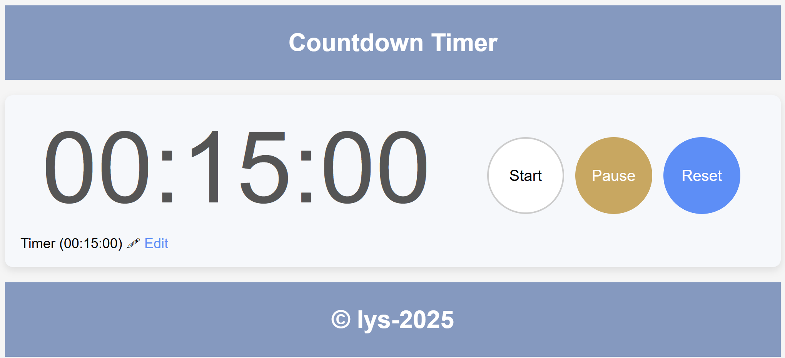

<h1 align="center">Assignment 3: Countdown Timer</h1>

- If you want to see both vanilla JS and JQuery script, you can examine both .js files.(index-jquerry.js, index-vanilla-js.js)
- You should change active HTML script in the index.html 
- If click 'Edit' also you can set timer with new value from input tag. 
- In second click the new value put on the timer and restart timer.
