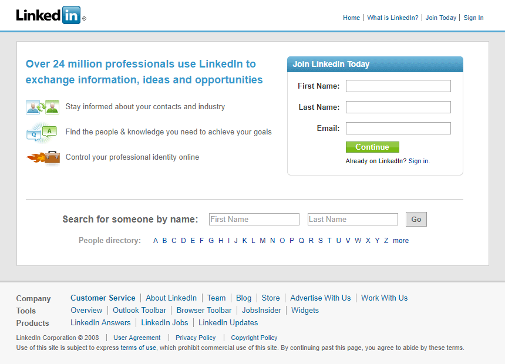

<h1 align="center">Front End Challenge - Linkedin</h1>

# Please make sure you follow the guidelines:

- Indent your code
- Validate your HTML
- Write clear IDs and Classes
- Avoid using Float and position absolute.
- Replicate the image below using HTML and CSS

